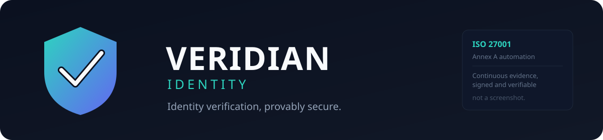

<p align="center">
  
</p>

<p align="center">
  <a href="#"></a>
  <a href="#"></a>
  <a href="docs/ISO27001_PROGRAM.md"></a>
  <a href="LICENSE"></a>
</p>

<h3 align="center">Identity verification, provably secure.</h3>

<p align="center">
  Veridian gives fintechs, marketplaces, and banks a single API to verify who<br>
  their users really are, without building a compliance team to do it.
</p>

---

## About Veridian

Veridian Identity, Inc. builds `veridian-verify`: an API and dashboard that
lets businesses confirm a real person is behind a new account before they
let them in. Upload a government ID, match a live selfie against it, screen
against sanctions and watchlists, and get a decision back in seconds,
without ever having to store a government ID yourself.

We started Veridian because every fintech and marketplace we talked to was
solving the same problem in-house, badly: unencrypted ID photos in a random
S3 bucket, no retention policy, no idea who on the team could still see
last year's uploads. Identity verification touches the most sensitive data
a company holds. We think the company doing that verification should be
held to a higher bar than the companies asking for it, not a lower one.

## What we do

- **Document capture and verification.** Government ID scan, format and
  authenticity checks, data extraction.
- **Liveness and face match.** A live selfie matched against the document
  photo, resistant to photo/video replay.
- **Watchlist and sanctions screening.** Continuous screening against
  global sanctions, PEP, and adverse media lists.
- **Developer-first API.** One endpoint, a webhook for the result, a
  dashboard for the humans who need to review edge cases.

```bash
curl https://api.veridian.dev/v1/verifications \
  -H "Authorization: Bearer $VERIDIAN_API_KEY" \
  -F "document=@passport.jpg" \
  -F "selfie=@selfie.jpg"
```

```json
{
  "verification_id": "ver_8f21a3c9",
  "status": "approved",
  "document": { "type": "passport", "country": "GB" },
  "checks": {
    "document_authenticity": "pass",
    "face_match": "pass",
    "watchlist_screening": "clear"
  }
}
```

## Why companies choose us

- **Built for the businesses that get audited, not just the ones that
  should be.** Our customers are banks and regulated fintechs; our own
  security posture has to clear the same bar theirs does.
- **We don't keep what we don't need.** Raw ID images and biometric data
  are processed and discarded on a short, enforced retention window, not
  kept "just in case."
- **Nothing we tell an auditor is a claim we can't prove.** Every control
  we say is in place is backed by evidence our own systems generate
  automatically, not a document someone wrote once and hoped stayed true.

## Company

| | |
|---|---|
| Stage | Early-stage, private beta |
| Team | Small, fully remote |
| Customers | B2B: fintechs, marketplaces, and banks embedding our API into their own onboarding |
| Data we handle | Government ID images, biometric face data, PII, verification decisions |
| Primary region | EU (`eu-west-1`), reflecting where most of our customers and their users are |

## Security and compliance

Identity verification is a security company first and a product company
second. Veridian is building toward ISO/IEC 27001 certification with a
control-automation-first approach: every control that can be enforced and
proven by code, is, continuously, not just at audit time.

Full program details, control mapping, and the automation architecture
live in [`docs/ISO27001_PROGRAM.md`](docs/ISO27001_PROGRAM.md).

To report a security issue, see [`SECURITY.md`](SECURITY.md).

## About this repository

Veridian Identity is a fictional company. This repo exists to design and
build a real, working ISO/IEC 27001:2022 Annex A control automation
program (real Terraform, real policies, real signed evidence) against a
realistic subject, the same way a training capstone uses a fictional
workload. See [`docs/ISO27001_PROGRAM.md`](docs/ISO27001_PROGRAM.md) for
the full purpose and scope statement. There is no legal entity, product,
or customer data behind any of it.

## License

Proprietary. All rights reserved, Veridian Identity, Inc.
